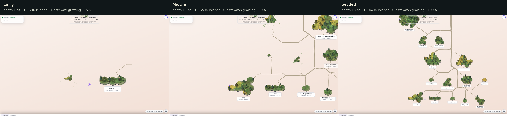
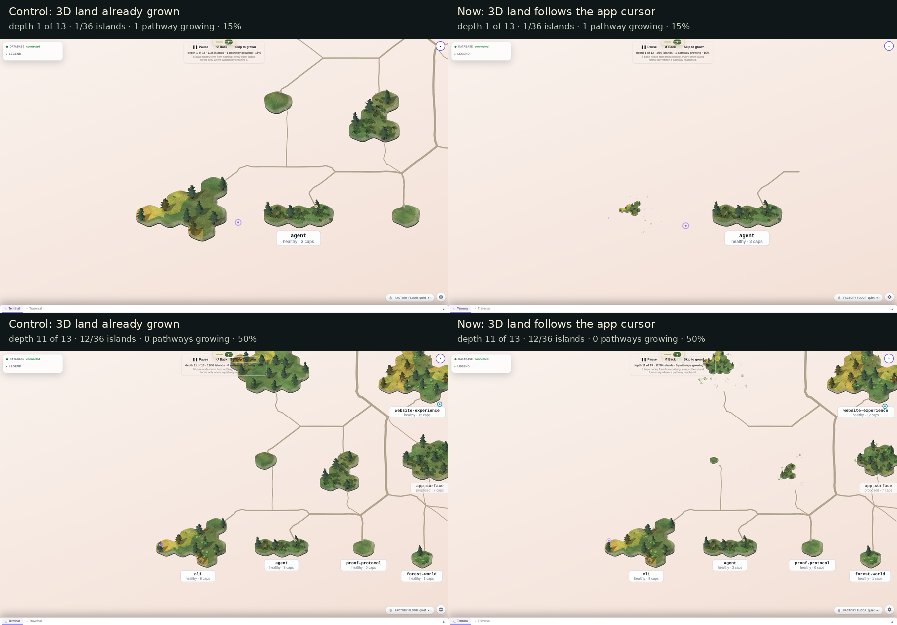

# The mounted forest grows with the app — 24 September 2026

The early view now opens on the starting islands, with a road growing out toward the rest of the forest. The control already has the land and roads in place. At the middle sample, further islands are still forming; at the end the 3D canvas is pixel-identical to the settled control.

These are the studio's ordinary opening view and its own intro camera. No fit-to-forest view, manual zoom or camera replacement was used. The intro naturally pulls back as it progresses; every active/control pair has exactly the same SVG, compositor and actual WebGL camera.

The left arm withholds only the mounted canvas's regrow presentation. Its app clock, flat overlay, camera and live data are the same as the right arm. The driver asserts that the withholding took effect and that the right arm actually receives the active presentation. The small islands and partial roads on the right are the real mounted consumer, not a helper-only demonstration.

[Open the short clock-sampled preview](regrow-sampled-preview.webp). It steps through five captured frames; **it is not real-time playback or a frame-rate measurement**. Native-size images are available for [early](active-early.png), [middle](active-middle.png), [late](active-late.png) and [settled](active-settled.png).

My impression is that the road front makes the order legible and the land now reads as growing into the map. The remaining little floating plants are distracting at intermediate stages. The diagnostic below identifies the flat overlay's contribution; the owner has already deferred this known plant appearance problem under the decision to adopt the mounted land. These pictures do not sign the owner's appearance verdict.

## What was checked

One fresh live PostgreSQL-backed API snapshot supplied every picture: **36 islands, 212 parcels, 95 routed edges, 113 distinct road segments, zero dropped routes**. App readouts were:

| Sample | Actual cursor | Landed islands | Roads growing |
| --- | ---: | ---: | ---: |
| Start | 0 | 0/36 | 0 |
| Early | 0.1499 | 1/36 | 1 |
| Middle | 0.4998 | 12/36 | 0 |
| Late | 0.7996 | 34/36 | 3 |
| Settled | 1 | 36/36 | 0 |

All five pairs have identical cursor readings, camera transforms, actual WebGL cameras, canvas dimensions, world layout, labels, status values and route data. Both arms reported zero page errors and zero console errors, including WebGL shader errors. The renderer was the **NVIDIA GeForce RTX 2060**, through ANGLE/OpenGL, with software rendering false. This is appearance evidence; no GPU duration or lower-end hardware-floor claim is made.

The settled **1800×1100 raw WebGL canvases are byte-identical: zero changed pixels**. [Active canvas](active-settled-canvas.png) and [control canvas](control-settled-canvas.png) are captured directly after a deliberate synchronous render, before the non-preserved drawing buffer clears. That harness render is not a quiet-frame or timing measurement. Full screenshots differ by 995 pixels outside this identical 3D result; they also contain the live SVG overlay and app chrome, so they are not claimed as identical. [Image verification](image-verification.json) records both comparisons.

## The floating tufts belong to the overlay

On the same held frame, disabling only `.world-scene .parcel-flora` removes the scattered coverage tufts around the early forming island and beneath the upper island at the middle sample. The driver verifies effective opacity zero and unchanged camera/cursor. The raw 3D canvas has none of those offshore tufts. The [early diagnostic](active-early-no-svg-coverage.png), [middle diagnostic](active-middle-no-svg-coverage.png), [early raw canvas](active-early-canvas.png) and [middle raw canvas](active-middle-canvas.png) retain that evidence.

This is a browser-only diagnosis, with no product styling change. The owner already named floating/colliding plants as deferred work when approving the mounted land (ADR-0608 D6); the same decision retires the flat vegetation picture after the 3D regrow is in place (D2). No additional follow-up or blocking question is created here.

## Reproduction and source identity

`capture.mjs` runs under `/tmp/storytree-heavy.lock` against the verified worktree server. It replaces only the app's `BROWSER_CLOCK` with a manually sampled wall clock; native renderer animation frames and ResizeObserver remain live. The control additionally replaces the mounted presentation expression with `null`. Neither replacement edits repository source. The clock stays held while the real canvas finishes drawing, so browser paint speed cannot choose the captured progress.

The run began at **2026-09-23 21:45:32 UTC** (24 September locally), on HEAD `2280c7a9cddf4d2d57198a16ec3d220bd19c3e1d`, including the then-uncommitted integration. The aggregate SHA-256 of all app/forest TypeScript and CSS source was `d5b3109739afbf971708a1fe82e598c8f636f9dc4716331b523cff62f19de12f` before and after; the driver rejects any source or HEAD change during a comparison. The live API snapshot SHA-256 was `597567047a8f79d5daf011074cda255f86c0e42143b99a75e9ab3d7c68a42e8e`. Raw API bodies stay private in `/tmp/laneK-api-snapshot.json`.

[The measurement ledger](measurements.json) contains the controls, effective state, camera readings, source fingerprints and data identity. `compose.py` makes the sheets and preview from literal captured pixels. Two initial instrument runs stopped before producing accepted evidence: Resource Timing did not retain the module URL, so the driver now records the actual request; the host's drawn marker preceded renderer readiness, so it now waits for the actual R3F store. A qualification run established those fixes before this final capture.
