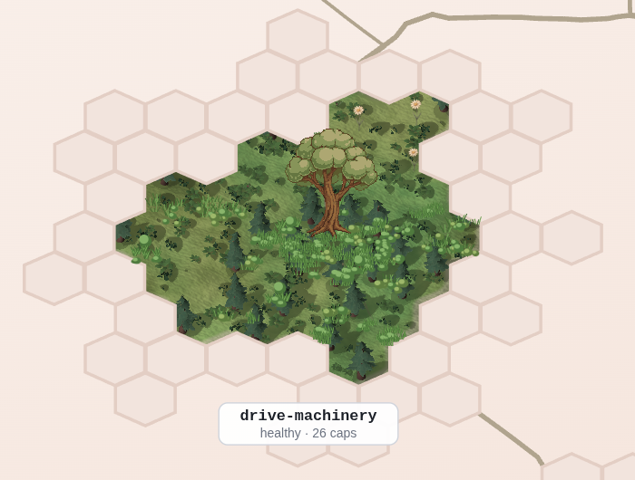
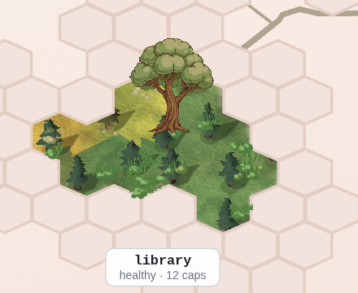
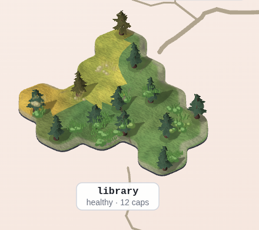
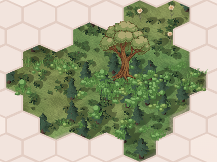
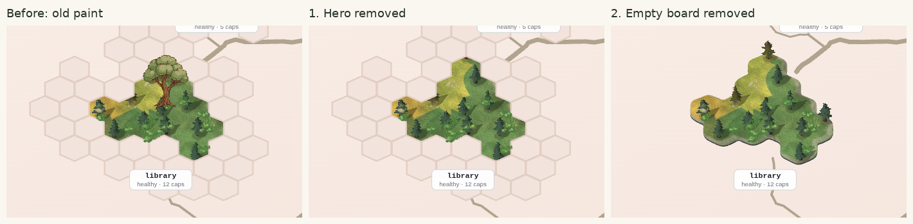
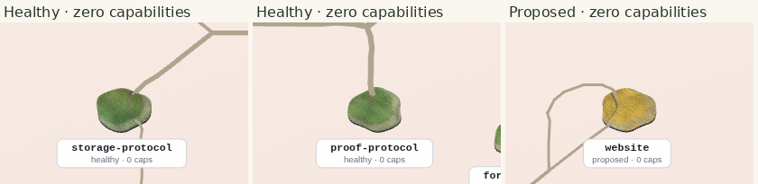
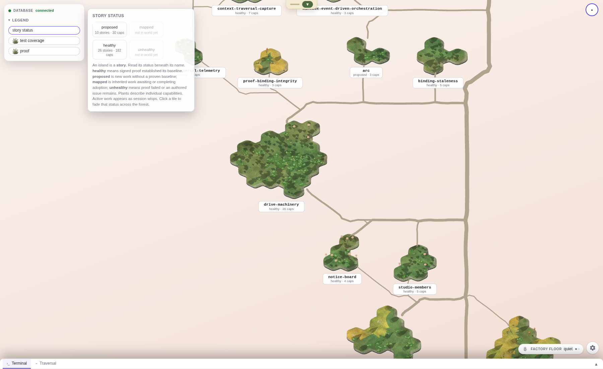
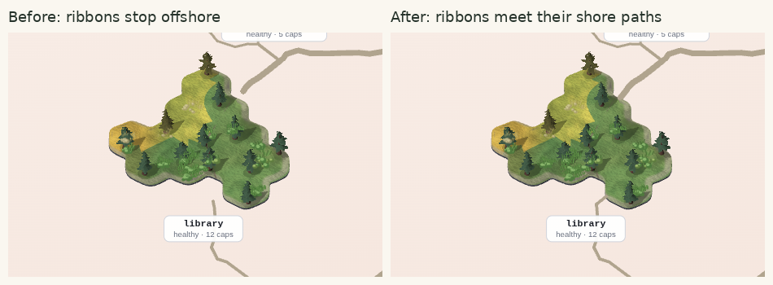
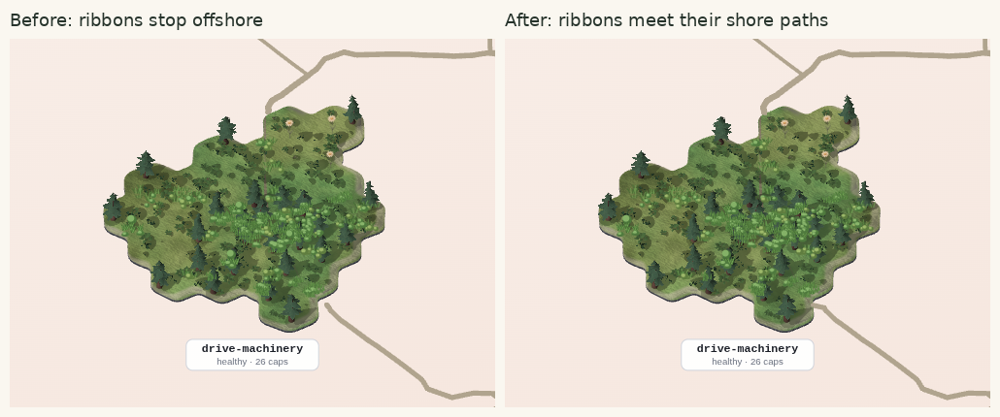
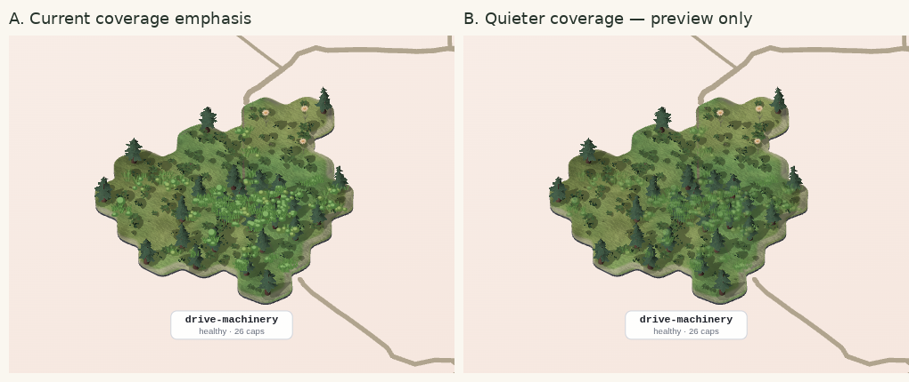

# Mounted land: design review, 23 September 2026

The biggest problem is the old map painted over the new land. Its opaque empty hexagons cut the smooth shoreline back into a board; the oversized painted tree then competes with the 3D pines. Removing those two layers makes a substantial improvement without changing the land art. The separate offshore road gap is now repaired as well; the controlled pictures below show each change.

This ranked review was written **before product changes**. The same-page diagnostic pictures change browser styling only; they are not a shipped fix or an owner verdict. The owner’s look remains the verdict on the whole.

## 1. Empty hexagons hide the coast and make every island look unfinished

**What is wrong:** a pale board surrounds every island and cuts chunks out of its smooth shoreline.

**Class:** TRANSITION. **Confidence:** high, a defect rather than a taste call. The empty SVG cells have opaque fills and sit above the 3D canvas. Temporarily hiding only `.hex-coast` reveals the actual smooth coast and more of the incoming roads. The canvas was drawing those pixels correctly underneath it. This is especially damaging to one-cell islands, whose empty board is much larger than their land.

**Fix:** suppress the empty board’s paint under `landMount`, preserving identity and picking. Keep the flat map unchanged. Do not reshape the 3D coast to compensate for an overlay.

## 2. The large painted tree looks pasted over a forest of much smaller trees

**What is wrong:** the broad-leaf tree uses a different drawing style and towers over the 3D pines on the same island.

**Class:** TRANSITION, with a scale/composition consequence. **Confidence:** high; removal is explicitly owner-authorised.

**Fix first, as requested:** hide the hero under either mounted arm, including its growth-track and fallback forms. Keep nameplates, coverage plants, UAT flowers, activity lights and picking. The nameplate’s explicit status word remains the story-level reading, including on zero-capability islands. The mounted ground also retains its existing status colour: where parcels differ, its colours describe those parcels and must not be mistaken for a replacement for the story’s status word. The legend must stop telling mounted-map readers to look for a big tree that no longer exists. No status is inferred from the decorative 3D pine species.

## 3. Some roads stop before they reach the island

**What is wrong:** the road ends in empty space just before the shore, so the connection looks broken.

**Class:** COMPOSITION. **Confidence:** high for the visible gap. The later trace found that the road ribbon still used its original offshore endpoint while the worn path already used a dock snapped to the coast. This crop is the **same-page diagnostic with empty board and hero paint hidden**, so it isolates the residual gap from defect 1. Both the north and south approach to Library are visible. No renderer geometry was changed to produce it.

**Fix:** make the visible ribbon consume the same coast dock as the worn path. Preserve which stories the roads connect, shared routing and status colours. This is now implemented and pictured below.

## 4. Dense islands have two competing vegetation styles

**What is wrong:** the flat, broad-leaf coverage plants and the smaller 3D pines merge into a busy carpet that makes the land hard to read.

**Class:** COMPOSITION. **Confidence:** medium; **the desired balance is taste**, not a proven surface defect. The flat plants encode capability status and test density, so deleting them would remove information. After the hero and board are gone, this may be acceptable.

**Owner options to stage after the clear fixes:** keep the present coverage emphasis, or make the coverage plants visually quieter while retaining their number, identity and interaction. Do not silently choose a new plant scale, density or palette. This is not authority to remove proof marks.

## Inspection and controls

The live PostgreSQL-backed studio served this worktree on port 5199. The browser checked ordinary opening, whole-forest fit, close views of **drive-machinery, library, website-experience, storage-protocol, proof-protocol and website**, native drag, and keyboard pan. The flat map, `?landMount=1`, and `?landMount=1&landMountProps=1` were compared. The last is the props staging arm shown in the owner’s original picture; the plain mount currently defaults to ground only.

Every view replays **one fresh live API snapshot**, captured for this review, rather than loading a different forest for each arm. Raw API data stays in `/tmp/laneI-api-snapshot.json` because it includes session/profile data. `before.json` and `inspect.json` record camera transforms, labels, identities and status readings. Full screenshots are in `before/` and `inspect/`; each ranked item above has a literal crop of those pixels. `capture.mjs` is the browser driver. Every render held `/tmp/storytree-heavy.lock`; no virtual clock was installed. No interaction-speed or hardware-floor claim is made.

At ordinary working zoom, the flat control has the same data and layout as the mount. The close inspection used native wheel/drag up to the fitted route’s allowed zoom ceiling. The apparent forest-wide sparseness and road prominence at fit are not being turned into new defects: the owner already has a separate spacing review, and an overview is not the reading scale for individual labels.

## Removal record and status check

**Fixed: defects 1 and 2.** Only under `landMount`, the empty SVG board and the flat central hero paint are transparent. This removes the opaque board that concealed the coast and the oversized tree that competed with kit vegetation. No 3D art, camera, layout, status value, coverage density or default flag was changed. The flat control remains unchanged.

These are three back-to-back screenshots of **one browser page** with one camera and one snapshot. The first temporarily restores the old board/hero paint, the second removes just the hero, and the third is the shipped cleanup. The driver asserts the effective opacity of all 36 hero images and the board at each step, as well as equal camera, forest, status and identity data. `finishing.json` records these controls. The initial attempt at restoring paint lost to CSS specificity; it was rejected and recaptured with checked effective styles. Its pictures are not used here.

The removal covers the normal growth-track image, the static baked hero, and procedural fallback artwork. The fallback’s human-witness sign remains, as do the enclosing hit regions. Capability coverage plants, UAT flowers, nameplates and session marks remain. The mounted legend now says **story status** and directs the member to the word beneath the island’s name; the default flat legend keeps its trees.

**Measured on this snapshot:** all 28 baseline views retain the same camera, forest identities, status values, label text and edge-element counts. All nine flat-control screenshots are **pixel-identical** before and after. The forest has 36 story labels (26 healthy, 10 proposed), 212 parcel states (182 healthy, 30 proposed), 342 edge-identity elements and 2,442 coverage-plant marks. Every mounted hero image has effective opacity zero. Storage Protocol and Proof Protocol remain explicitly healthy with zero capabilities; Website remains explicitly proposed with zero capabilities. Mapped and unhealthy remain in the unchanged status vocabulary, but this snapshot contains neither, so they are not claimed as live visual observations.

`verify-and-compose.py` checks the paired data, exact flat-image equality and effective paint controls, and generates the literal crops above. The full PNGs remain beside their ledgers. No new performance claim or owner visual signature is made.

## Road connection repair

**Fixed: defect 3.** The visible sea ribbon now consumes the same clipped-coast dock calculation as the on-island worn path. The helper landed in [PR #2036](https://github.com/storytree-ai/storytree02/pull/2036); the renderer now passes its returned descriptors to the actual road mesh. Routing, road width, palette and vegetation are unchanged.

These literal crops compare the same frozen live snapshot and camera before and after the renderer wiring. The original empty board and hero are already absent in both arms. `roads-before.json` and `roads-after.json` have the identical snapshot hash and matching camera, world, labels, status values and paint counts in all 28 views; both captures report zero page errors. The full PNGs remain in `roads-before/` and `roads-after/`.

`verify-roads.py` records eight pixel-identical full flat screenshots. The ninth, whole-forest fit, has 2,686 changed pixels only at the top toolbar and bottom-right control blur edges (maximum channel difference 6/255); its entire forest region is pixel-identical. This is reported explicitly in `roads-verification.json`, not counted as a ninth identical full screenshot. The earlier cleanup comparison above independently had nine identical flat controls.

The original ranked review was committed as `8d381733` before product changes and before reading the later owner-spotted road follow-up. It already separated covering hex paint (1) from the residual endpoint gap (3). The lane brief itself suggested the hex ring, so this is a confirmed diagnosis, not a claim of an unprompted discovery. The owner’s final look remains the overall appearance verdict.

## The remaining taste choice

**A** keeps the present coverage emphasis. **B** previews the same plants at 55% opacity: their count, position, status data and interaction are unchanged, and the 3D land/props are identical. B is a browser-only preview and **is not implemented in the product**. It makes the ground a little easier to read but makes the coverage signal less prominent. My preference is B; that is a non-binding taste judgment, not a defect verdict. Keeping A is a valid answer. The choice is saved on the mounting initiative as **OWNER: Keep or quiet the mounted coverage plants** (`oq-owner-keep-or-quiet-the-mounted-coverage-plants`).

The whole map after the clear cleanup is also available at [ordinary opening](roads-after/props-opening.png), [whole-forest fit](roads-after/props-fit.png), and [the dense island](roads-after/props-drive-machinery.png). The land remains behind its existing flags; promotion to the default map is not part of this change.
