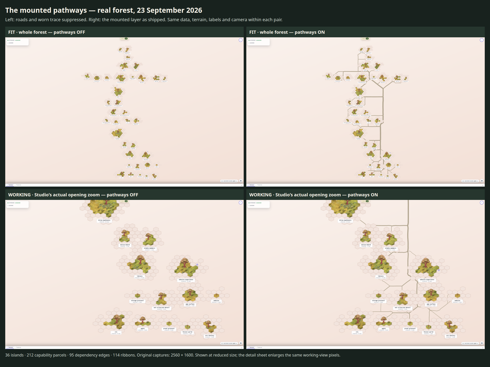
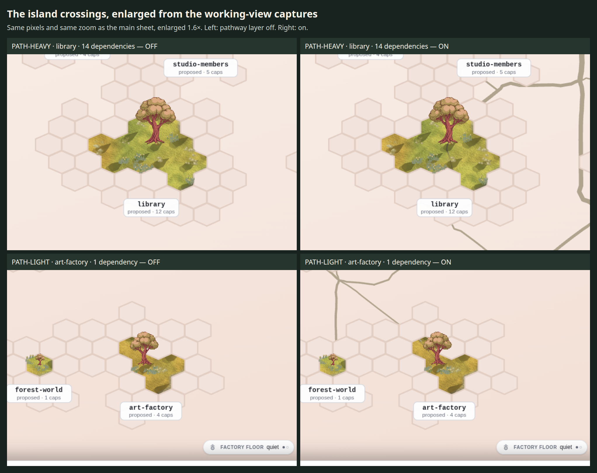

# The mounted pathways at fit and working zoom

The layer implemented by #2029 is staged here on the real live forest. This is an evidence landing: no product code, pathway semantics, status vocabulary or art constants change. The owner’s visual verdict is still open; these measurements do not grant it.





## The observation

The dependency network is clear in both views. The shared trunk is prominent at fit; inside the islands the worn trace is much subtler than the connecting ribbons and competes with the existing vegetation. That is the agent’s assessment, not an owner attestation. The enlarged details use the original working-view pixels; they are not a second, more flattering camera.

## Source and control

Captured 2026-09-23T09:08:18.739Z on laneH, commit `b02932431b300b614292f2e47e1ae8b0eaf09568`, from the live PostgreSQL-backed studio in this worktree. Both views reuse one fresh set of API responses. The later status reader replays those exact responses and verifies the camera and parcel identities against this capture. Snapshot SHA256: `0f9afb55e580b3b80477c5b11f244216e42d9e34680350e6d6fb0f2332964800`. The raw API responses remain local because they also contain session/profile data; the drawable forest exports and measurement outputs are committed.

Every render and timing run held `/tmp/storytree-heavy.lock`. The final bundle waited for lane G’s gate to release it. The table below is the machine’s own before/after report, including two current CPU samples after vmstat’s since-boot row:

```text
{'at': '2026-09-23T09:08:18.739Z', 'load': '0.96 2.53 1.79 1/869 807726', 'cpu': 'procs -----------memory---------- ---swap-- -----io---- -system-- -------cpu-------\n r  b   swpd   free   buff  cache   si   so    bi    bo   in   cs us sy id wa st gu\n 0  0      0 7673368 2416832 20059188    0    0    24   363 1053    0  1  0 99  0  0  0\n 0  0      0 7841916 2416832 20059224    0    0     0     0 1470 1178  0  0 100  0  0  0\n 0  0      0 7850912 2416832 20059224    0    0     0     0  453  234  0  0 100  0  0  0', 'gpu': 'NVIDIA GeForce RTX 2060, 0 %, 0 %, 128 MiB, 51, 300 MHz'}
{'at': '2026-09-23T09:09:31.178Z', 'load': '1.57 2.32 1.77 3/931 808312', 'cpu': 'procs -----------memory---------- ---swap-- -----io---- -system-- -------cpu-------\n r  b   swpd   free   buff  cache   si   so    bi    bo   in   cs us sy id wa st gu\n 2  0      0 3384344 2417092 20143968    0    0    24   364 1055    0  1  0 99  0  0  0\n 2  0      0 3272736 2417092 20143972    0    0     0     0 5621 3913 16  1 83  0  0  0\n 2  0      0 3181384 2417092 20143976    0    0     0   284 5804 3703 16  1 83  0  0  0', 'gpu': 'NVIDIA GeForce RTX 2060, 0 %, 0 %, 861 MiB, 53, 345 MHz'}
```

The off control changes only Three `Line2.visible` and the ground material’s `uWearMix` (to zero). Ground geometry, all other shading, status inputs, camera and SVG foreground remain fixed. The renderer retains the same wear shader even at zero strength; the timing difference is not the full cost of deleting the pathway implementation or constructing its textures. SVG trail strokes stay suppressed in both arms. The stills freeze browser time and decorative animations, then assert byte-identical foreground SVG. Hardware GPU queries are independent of this clock. Browser cadence is measured separately on fresh pages without an installed virtual clock.

## Inventory and zoom

| View | Camera scale | Islands | Capability parcels | Edge-identity elements | 3D ribbons |
|---|---:|---:|---:|---:|---:|
| fit | 1.031579 | 36 | 212 | 342 | 114 |
| working | 2.947027 | 36 | 212 | 342 | 114 |

The live routing reports {'edges': 95, 'segments': 114, 'caves': 0, 'dropped': []}. Capability states are {'proposed': 210, 'mapped': 2}. Identity is identical on/off. Both foreground equalities are asserted, not inferred from screenshots.

Current mounted ground bounds (X/Y/Z): `{'min': [60.22262954711914, -2.7160940170288086, 62.73550796508789], 'max': [908.7555541992188, 1.590526819229126, 1832.110595703125], 'size': [848.5329246520996, 4.306620836257935, 1769.375087738037], 'axes': 'world X,Y,Z; Y is elevation, X/Z are ground plane'}`. X/Z are the ground plane; Y is elevation. The scene-export width/height are projected map dimensions and must not be compared directly with ground-plane dimensions. No pre-23-September dimensions or crowd-scene figures are used.

## Repeated GPU frame cost

RTX 2060, hardware ANGLE OpenGL renderer, 2560×1600 CSS viewport, device scale 1. Six warm-up sweeps precede two independent interleaved runs. Each table cell reports median milliseconds per redraw over five GPU-timed batches of 30 renders. This measures the mounted WebGL layer, not complete-page latency or an Adreno acceptance floor.

| View | Roads | Run 1 median / range (ms) | Run 2 median / range (ms) | Reproduces within measured range |
|---|---|---:|---:|---|
| fit | off | 0.7254 / 0.0022 | 0.7249 / 0.0018 | True |
| fit | on | 0.7715 / 0.0052 | 0.7733 / 0.0056 | True |
| working | off | 1.0174 / 0.0114 | 1.0186 / 0.0117 | True |
| working | on | 1.0687 / 0.0087 | 1.0697 / 0.0072 | True |

All four rows reproduce. Roads add approximately 0.047 ms at fit and 0.051 ms at working zoom; both deltas exceed their rows’ measured ranges. Draw calls are 1 without roads, 115 at fit with roads and 42 in the working view after culling. The machine was quiet before capture (100% CPU idle in both current samples, 0% GPU use); the post-capture sample includes this experiment’s own browsers (83% CPU idle). Lane G’s gate had released the lock before measurement.

A row that does not reproduce is not quoted as a stable cost. Agreement against a broad within-run range does not resolve a small on/off difference; raw batch samples remain in measurements.json. No work is scoped from one ratio.

## Status measured from actual ground pixels

The mask uses the mounted ground’s exact geometry and status-index attribute. Existing `harness/status-truth.ts` supplies the reference palette and nearest-family reader. Each visible ground pixel is compared with the family its own capability parcel carries; building/proposed share the owner-approved colour family. Transparent background, skirt rows and mixed antialias mask pixels are excluded. This is a colour-reader measurement of the ground canvas; SVG vegetation, labels and the owner’s perception are not measured by it.

| View | Expected family | Pixels | Own-family share: off | Own-family share: on | Pixels changing read |
|---|---|---:|---:|---:|---:|
| fit | mapped | 423 | 100.00% | 100.00% | 0 |
| fit | building | 67375 | 83.35% | 82.51% | 781 |
| working | building | 216322 | 83.73% | 83.10% | 1832 |

The pathway layer reduces the proposed/building family’s own-colour share by **0.85 percentage points at fit** and **0.62 points at working zoom**; mapped pixels do not move. This snapshot has 210 proposed and two mapped capabilities, so other expected status families are **not measured here**. Earlier exploratory loads showed different live proof states; their screenshots and figures are not mixed into this final set. The final captured ground is about **849 × 1769 ground units** after today’s layout changes, not the older corridor dimensions in the launch brief. This is an observed live-layout extent, not a fixture substitution.

## Native browser cadence at rest

Two 180-frame windows per arm, with normal decorative animations running and no virtual clock. These are whole-page rAF intervals at rest; they do not measure a drag or regrow. A late frame is greater than 25 ms.

| View | Roads | Median / p95 / worst (ms) | Late / observed |
|---|---|---:|---:|
| fit | off | 16.70 / 16.80 / 33.30 | 1 / 360 |
| fit | on | 16.70 / 16.80 / 33.40 | 15 / 360 |
| working | off | 16.70 / 16.80 / 50.00 | 14 / 360 |
| working | on | 16.70 / 16.80 / 33.30 | 6 / 360 |

All arms have a 16.7 ms median and 16.8 ms p95 at rest. The late-frame count moves in opposite directions at the two views; these short windows do not isolate a consistent pathway penalty or claim interaction performance.

## Reproduction and remaining verdict

Run `capture.mjs`, then `status.mjs`, then `sheet.mjs` from the repository root, with a dedicated live-store studio specified by `LANEH_URL`, `DISPLAY=:0` on this Mint box, and the entire sequence under `flock /tmp/storytree-heavy.lock`. The scripts refuse a foreign/stale server, software GPU, missing GPU clock, changed data/camera, hidden timing page or empty status sample. Capture writes the local `.laneH/api-snapshot.json` used by the status reader. Do not publish that API snapshot.

The owner look is recorded as `oq-laneh-mounted-pathways-visual-verdict`, linked from the original increment on `three-d-pathways-arc`. The increment remains open until that verdict is supplied. Any visual retune belongs on this same initiative and must preserve pathway meaning and the status measurements.
